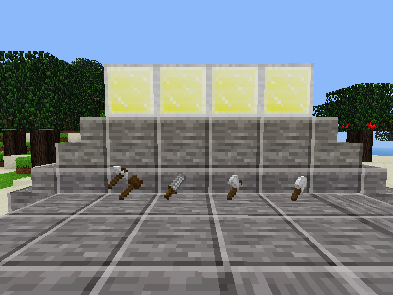

# Tincraft

Tin, from moreores, is pretty useless in most games.

Here's some crafts to make tin marginally useful.

## Tin Tools

All tools are pretty effective - but they just drop items on the floor.

* Cheap Dagger - same recipe as a sword
* Weak Hatchet - same recipe as an axe
* Toy Spade - same recipe as a shovel
* Brittle Chisel - tin ingot on top of a stick
* Chisel Mallet - tree block on top of a stick
* Mallet and Chisel - Chisel and Mallet in the craft grid

They do OK damage to mobs, but don't expect them to last long. They're also useless against players.

## Tin Recipes

You can enable an additional craft recipe, Strong Tin - by default it is off.

To enable in client, use the Settings tab, choose Advanced Settings, and expand Mods : tincraft. Enable strong tin.

To enable on server, add `tincraft.strongtin = true` to your `minetest.conf`.

With strong tin, players can make steel:

1. Make strong tin using 3 tin ingots
2. Make a stone and metal mix using tin and stone
3. Cook the stone and metal mix to obtain an iron lump

Yes, it's more alchemy than craft, and you need a lot of tin, but if the area has been stripped of iron, this is your second best bet...
